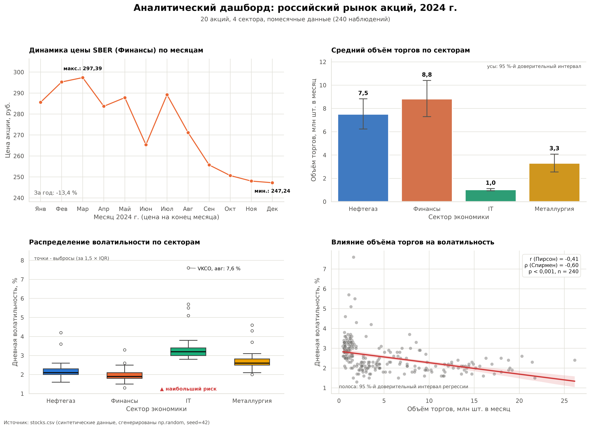

# Практика 2: визуализация данных (Matplotlib и Seaborn)

Аналитический дашборд из 4 графиков по 20 акциям российского рынка за 2024 год. Задание из методички «Визуализация данных: библиотеки Matplotlib и Seaborn», раздел 8.



## Структура

```
.
├── generate_data.py   # генерация stocks.csv (20 тикеров, 4 сектора, 12 месяцев)
├── dashboard.py       # дашборд 2x2, текстовые выводы, сохранение в PNG
├── stocks.csv         # входные данные (240 строк)
├── dashboard.png      # результат (300 dpi, bbox_inches='tight')
├── report.txt         # аналитические выводы, сохранённые из dashboard.py
└── requirements.txt
```

## Запуск

```bash
python3 -m venv .venv && source .venv/bin/activate
pip install -r requirements.txt
python dashboard.py
```

Полезные параметры:

```bash
python dashboard.py --no-show         # без окна с графиком (для скриптов)
python dashboard.py --ticker YNDX     # график 1 для другой акции
python generate_data.py --seed 7      # пересоздать stocks.csv с другим seed
```

Если `stocks.csv` нет, `dashboard.py` сам сгенерирует его.

## Что построено

| № | Тип | Функция | Что показывает |
|---|-----|---------|----------------|
| 1 | линейный | `ax.plot` | Динамика цены SBER по месяцам, маркеры, подписи минимума и максимума, изменение за год |
| 2 | столбчатый | `sns.barplot` | Средний объём торгов по секторам, цвет по секторам, 95 %-й доверительный интервал |
| 3 | boxplot | `sns.boxplot` | Распределение волатильности по секторам, подпись главного выброса и сектора с наибольшим риском |
| 4 | scatter + регрессия | `sns.regplot` | Зависимость волатильности от объёма, линия тренда с доверительной полосой, r, ρ, p |

Общий заголовок задан через `fig.suptitle()`. Цвет сектора одинаков на всех графиках и взят из проверенной категориальной палитры (контраст и различимость при дальтонизме проверены валидатором). Числа даны с разделителями тысяч, у осей указаны единицы измерения, внизу указан источник.

## Данные

Данные синтетические (`np.random`, seed 42), но устроены правдоподобно: у каждого сектора свой уровень волатильности, у каждой бумаги свой типичный объём, цена идёт случайным блужданием, изредка случаются «шоковые» месяцы с выбросами волатильности. Первые два месяца для GAZP, SBER, LKOH, YNDX и GMKN заданы ровно как в условии. Это учебные данные, а не реальные котировки.

## Выводы (из `report.txt`)

1. **Самый волатильный сектор: IT.** Медиана дневной волатильности 3,20 % против 1,90 % у Финансов, то есть в 1,7 раза выше. Самый резкий выброс: VKCO в августе, 7,6 %.
2. **Самая дорогая акция: GMKN.** Средняя цена за год 13 113 руб. Цена одной бумаги не говорит о размере компании.
3. **Объём торгов:** лидирует Финансы (8,8 млн шт. в месяц), меньше всего торгуется IT (1,0 млн шт.).
4. **Связь объёма и волатильности:** r = −0,41, ρ = −0,60, p < 0,001, то есть умеренная отрицательная корреляция. Но внутри секторов она слабая и разного знака (от −0,08 до +0,31). Общий тренд объясняется различиями между секторами: рискованный IT торгуется малыми объёмами. Это пример смешения групп (парадокс Симпсона), а не доказательство, что объём «снижает» волатильность.
5. **Динамика за год:** лучшая бумага HEAD (+69,8 %), худшая GMKN (−33,9 %). Данные синтетические, это не инвестиционная рекомендация.

## Ответы на контрольные вопросы

1. **`sns.barplot()` и `plt.bar()`.** `plt.bar` рисует готовые высоты, которые вы посчитали сами. `sns.barplot` принимает DataFrame, сам агрегирует (по умолчанию среднее) и рисует доверительный интервал. Seaborn нужен для сырых наблюдений, `plt.bar` для уже готовых значений или нестандартной оформительской работы.
2. **Доверительный интервал на `barplot`.** Диапазон, в котором с вероятностью 95 % лежит истинное среднее. Seaborn считает его бутстрепом: многократно пересэмплирует наблюдения, считает среднее и берёт 2,5-й и 97,5-й процентили. Узкие усы значат, что среднее оценено надёжно (как у IT на графике 2).
3. **Как читать boxplot.** Ящик идёт от 25-го до 75-го процентиля, это межквартильный размах IQR (Q3 − Q1). Линия внутри ящика медиана. Усы тянутся до самых далёких точек в пределах 1,5 × IQR от ящика, точки за усами выбросы.
4. **Знак корреляции на тепловой карте.** Положительная (красный): признаки растут вместе. Отрицательная (синий): один растёт, другой падает. Около нуля (белый): линейной связи нет. Значение ±1 означает идеальную линейную связь.
5. **Зачем `plt.tight_layout()` перед `plt.show()`.** Она подгоняет отступы так, чтобы подписи осей, заголовки и легенда не наезжали друг на друга и не обрезались. После `show()` менять раскладку уже поздно.
6. **Зачем `alpha` в scatter.** Прозрачность показывает плотность: где точки перекрываются, цвет получается темнее. Без неё скопление скрывается в одно пятно (на графике 4 так выглядит область малых объёмов).
7. **Форматы сохранения.** Для полиграфии PDF или SVG (вектор) либо PNG при `dpi=300`. Для веба SVG (вектор, масштабируется) или PNG. Сохранять надо до `plt.show()`.
8. **Несколько графиков на холсте.** `plt.subplots(rows, cols)` сразу создаёт фигуру и массив осей (`fig, axes`). `plt.subplot(r, c, i)` создаёт по одной оси за вызов по номеру, это старый «pyplot»-стиль, менее удобный и менее наглядный. Рекомендуется `subplots`.
